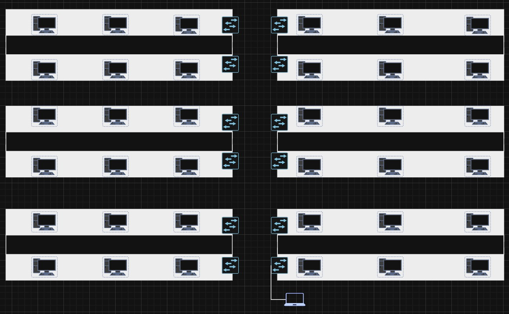
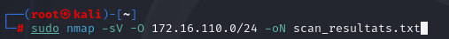
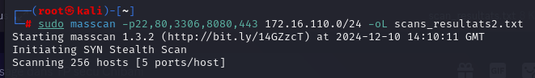
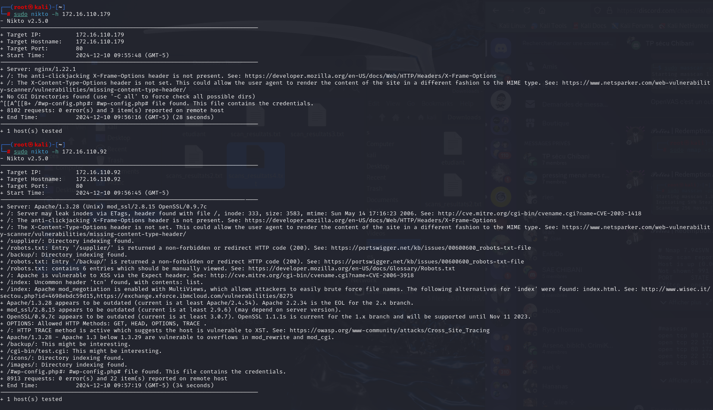
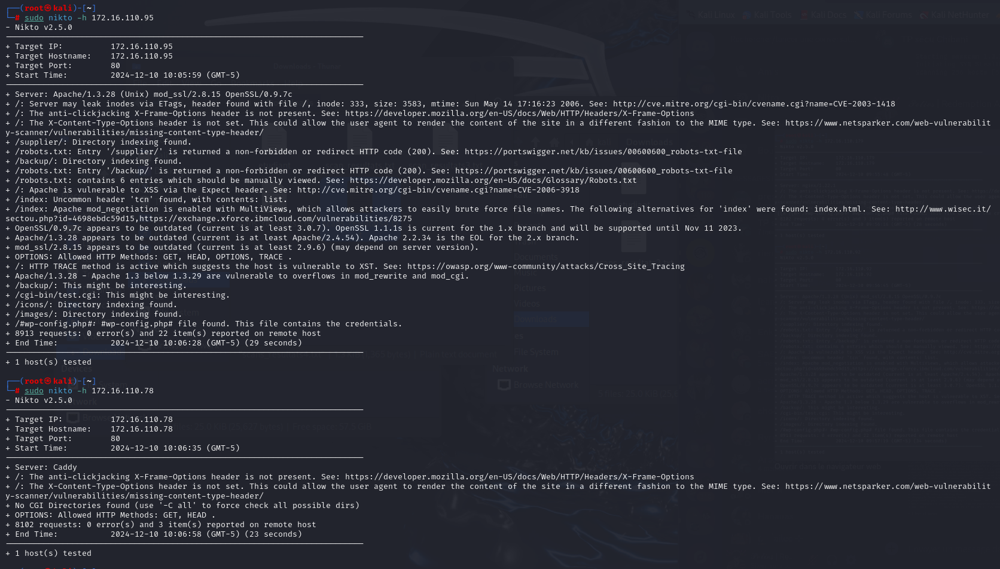

# audit-securite-wiki
# Wiki d'Audit de Sécurité

Bienvenue sur le wiki d'audit de sécurité. Ce document présente un guide complet pour effectuer un audit de sécurité d'une infrastructure réseau.

---

## **1. Objectifs de l'Audit**

L’objectif de ce TP n°2 est d’appliquer les notions théoriques et pratiques des séances de CM et de TD. De cette façon, nous allons pouvoir comprendre l’infrastructure du réseau cible en documentant sa topologie. Nous pourrons également identifier les vulnérabilités et les faiblesses à l’aide de divers outils d’analyse tout en élaborant une checklist pour structure un audit de sécurité. Enfin, nous prendrons soin d’exécuter des tets d’intrusion en simulant des attaques réelles et en proposant des recommandations pratiques pour sécuriser le réseau.

L’organisation de ce TP sera ici divisée en 4 parties à savoir :
-	L’Analyse Fonctionnelle Simulée
-	L’utilisation d’Outils d’Analyse
-	La Préparation de l’Audit
-	Les tests d’intrusion

Une conclusion sera ensuite rédigée avec le retour des observations et expériences sur ce TP, en portant attention sur l'important de ces exercices dans le contexte des audits de sécurité.


---

## **2. Analyse Fonctionnelle Simulée**


Ce premier exercice va nous permettre de comprendre la topologie réseau et ses points faibles potentiels. La première étape reste donc d'identifier les différents équipements réseaux de notre topologie comme les PC, les switch, les serveurs webs etc. Pour ce faire voici une maquette draw.io qui récapitule tous ces événements :




   - Eléments relevés :
     - Réseau de la salle : `172.16.110.0/24`.
     - Nombre de PCs : `38`.
     - Nombre de Switchs : `12`.

Les différentes commandes à suivre seront donc effectuées depuis mon ordinateur portable, ce dernier étant directement au réseau de la salle de l'IUT via un cable ethernet. De plus, on aurait également pu essayer de construire et de découvrir la topologie du réseau de facon automatisée avec l'utilisation des 2 commandes Nmap : 

**Ping sweep pour détecter les hôtes actifs :**
   ```bash
   sudo nmap -sn 192.168.1.0/24
   ```

**Détection des services et versions :**
   ```bash
   sudo nmap -sV -A 192.168.1.10
   ```

Pour finir, on peut conclure que la topologie d'un réseau peut fortement influencer la sécurité. En effet, une segmentation réseau bien concue (séparation LAN/DMZ...) limite la propagation des attaques tandis qu'une mauvaise configuration expose des ressources sensibles.

---

## **3. Utilisation d’Outils d’Analyse**

Afin de réaliser cette partie, nous allons nous servir d'outils tels que nmap et masscan depuis une VM Kali Linux dans le but d'analyser les résultats de ces commandes pour identifier les vulnérabilités. Pour masscan, on utilisera cette commande qui permettra de détecter les ports ouverts sur des machines cibles de sorte à déceler les vulnérabilités potentielles à partir du résultat. Ce dernier est concu pour effectuer des scans réseau à une vitesse élevée, en analysant des millions d'adresses IP en un temps réduit. En termes d'avatanges, on peut considérer que masscan est bien plus rapide que nmap pour le balayage des ports sur de grandes plages IP. Cependant il fournit moins de détails et il est souvent utilisé en compléments d'outils. Pour finir sa vitesse de balayage est hautement personnalisable car elle dépend des techniques d'envoi de paquets TCP/UDP en masse, de l'ordre de millions de paquets par seconde maximum.

En ce qui concerne nmap, cet outil permet d'analyser en profondeur les réeaux et systèmes, de détecter des ports ouverts, d'identifier des services actifs, et de déterminer les versions des logiciels ou systèmes d'exploitation. On l'utilisera ici pour compléter l'analyse en profondeur des services exposés. On se servira également de l'outil nikto pour scanner les applications web sur les hôtes détectés.


### **Nmap**

1. **Scan complet des ports depuis une adresse de réseau :**
   ```bash
   sudo nmap -sV -O 172.16.110.0/24 -oN scan_resultats3.txt
   ```

   

La commande effectuée réalise un scan réseau sur le sous-réseau 172.16.110.0/24 pour détecter les ports ouverts, identifier les versions des services associés ainsi qu'analyser le système d'exploitation des hôtes. Cette commande possède également plusieurs arguments qui sont :

* -sV : Active la détection de versions des services sur les ports ouverts. Cela va permettre d'identifier les logiciels et leurs versions qui seront exécutes depuis les hôtes.
* -O : Active la fonctionnalité de détection du systèmes d'exploitations en analysant les caractéristiques des paquets envoyés et répondus par les hôtes.
* -On scan_resultats3.txt : Enregiste les résultats du scan dans un fichier au format txt.

En examinant de plus près le fichier texte [scan_resultats3.txt](scan_resultats3.txt), 
### **Masscan**

1. **Scan rapide d’un réseau complet :**
   ```bash
   sudo masscan -p22,80,3306,8080,443 172.16.110.0/24 -oL scans_resultats4.txt
   ```

   

La commande précédente utilise masscan afin d'effectuer un outil de scan réseau rapide, pour analyser un sous réseau (172.16.110.0) et détecter les ports ouverts sur des machines cibles. Elle comporte égalemeent certains éléments qui sont :

* -p22,80,3306,8080,443 : Spécifie les ports à scanner, 22 pour SSH, 80 pour HTTPS, 3306 pour Mysql, 8080 pour HTTP alternatif, 443 pour HTTPS.
* -oL scans_resultats4.txt : Spécifie que les résultats du scan seront sauvegardés dans un fichier au format txt.
   
### **Nikto**

1. **Analyse d'une application web :**
   ```bash
   nikto -h http://192.168.1.XX
   ```

   
   
   
Enfin, la dernière commande utilise l'outil Nikto, un outil d'analyse de sécurité pour les serveurs web, sur une machine cible spécifique. Le paramètre -h spécifie l'hôte cible, tandis que "172.16.110.XX" représente l'adresse IP de la machine cible ou le serveur web est analysé. L'utilité de cette commande est donc d'identifier les vulnérabilités sur le serveur web et d'évaluer la conformité et la sécurité des applications hébergées depuis la machine.

---

## **4. Tests d’Intrusion**

### **4.1. Utilisation de Metasploit**

1. **Lancer Metasploit :**
   ```bash
   msfconsole
   ```
2. **Recherche de modules :**
   ```bash
   search ssh
   ```
3. **Configurer l’exploit :**
   ```bash
   use exploit/unix/ssh/openssh
   set RHOST 192.168.1.10
   set RPORT 22
   run
   ```

---

## **5. Recommandations**

### **5.1. Résumé des vulnérabilités trouvées**

- Ports inutiles ouverts (ex. : 3306 MySQL).
- Absence de headers de sécurité (Nikto).
- CVE critiques détectées (OpenVAS).

### **5.2. Recommandations pratiques**

1. Fermez les ports inutiles.
2. Mettez à jour les versions des services.
3. Appliquez des règles strictes au pare-feu.

---

## **6. Conclusion**

---

